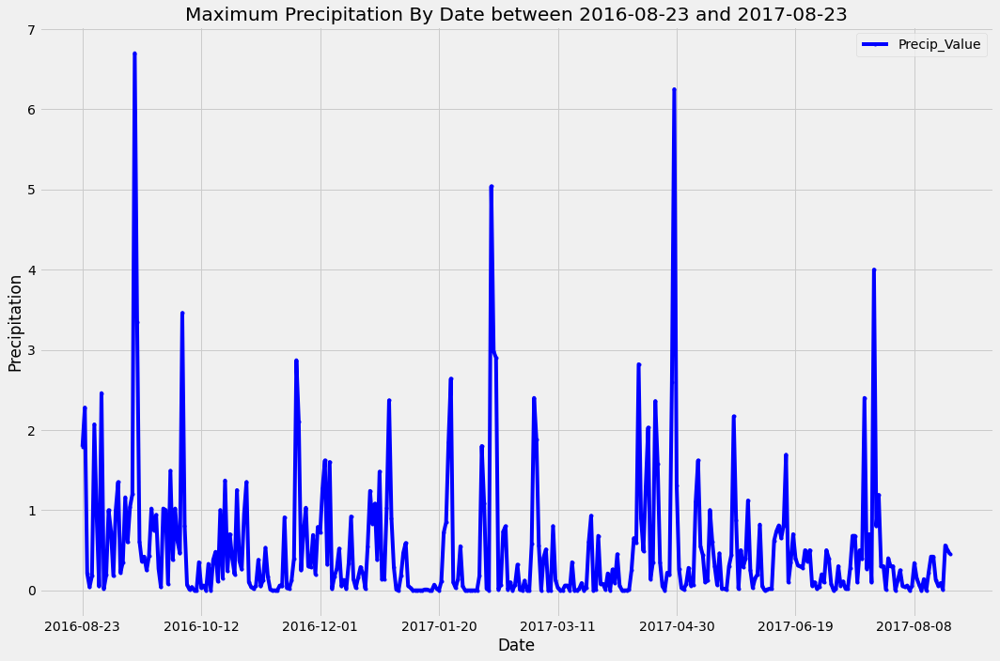

# SQLAlchemy Challenge - Surfs Up!

## Deliverables:

## Step 1 - Climate Analysis and Exploration
### Jupyter Notebook - Climate Analysis and Exploration
[Main Jupyter Notebook for Climate Analysis](climate.ipynb)

### Graphs - Climate Analysis and Exploration

## Step 2 - Climate App
### Flask Application
[Flask Application - app.py](app.py)

## Step 1 - Climate Analysis and Exploration

To achieve this I used [hawaii.sqlite](Resources/hawaii.sqlite) and using SQLAlchemy, Pandas, Matplotlib and Numpy wrote my code in the [Jupyter Notebook for Climate Analysis](climate.ipynb)

### Precipitation Analysis

* Start by finding the most recent date in the data set.

* Using this date, retrieve the last 12 months of precipitation data by querying the 12 preceding months of data. **Note** you do not pass in the date as a variable to your query.

* Select only the `date` and `prcp` values.

* Load the query results into a Pandas DataFrame and set the index to the date column.

* Sort the DataFrame values by `date`.

* Plot the results using the DataFrame `plot` method.

  

* Use Pandas to print the summary statistics for the precipitation data.

  

### Station Analysis

* Design a query to calculate the total number of stations in the dataset.

* Design a query to find the most active stations (i.e. which stations have the most rows?).

  * List the stations and observation counts in descending order.

  * Which station id has the highest number of observations?

  * Using the most active station id, calculate the lowest, highest, and average temperature.

  * Hint: You will need to use a function such as `func.min`, `func.max`, `func.avg`, and `func.count` in your queries.

* Design a query to retrieve the last 12 months of temperature observation data (TOBS).

  * Filter by the station with the highest number of observations.

  * Query the last 12 months of temperature observation data for this station.

  * Plot the results as a histogram with `bins=12`.

    

* Close out your session.

- - -

## Step 2 - Climate App

The part was achieved by creating a [Flask Application](app.py) based on the queries in Step 1 (Jupyter Notebook).

### Routes

* `/` Home page -  List all routes that are available.

* `/api/v1.0/precipitation` - JSON representation of the Precipitation dictionary.

* `/api/v1.0/stations` -  JSON list of stations from the dataset.

* `/api/v1.0/tobs` - JSON list of temperature observations (TOBS) for the previous year.

* `/api/v1.0/<start>` - JSON list of the minimum temperature, the average temperature, and the max temperature for all dates greater than or equal to the Start Date.

* `/api/v1.0/<start>/<end>` - JSON list of the minimum temperature, the average temperature, and the max temperature between a given Start Date and End Date range.

